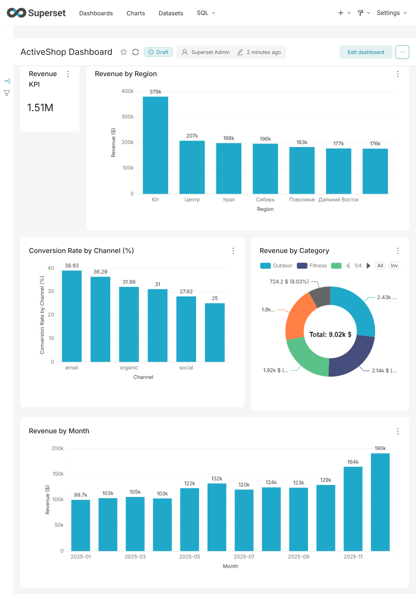
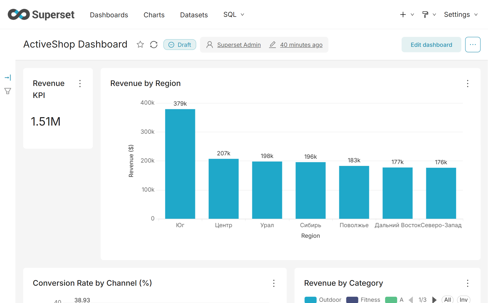
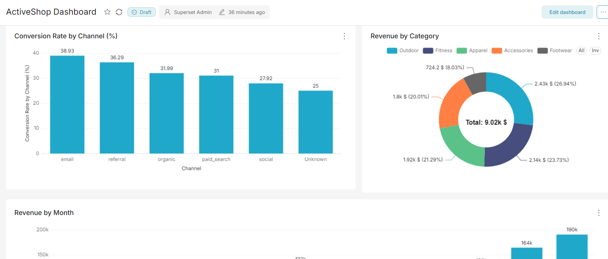
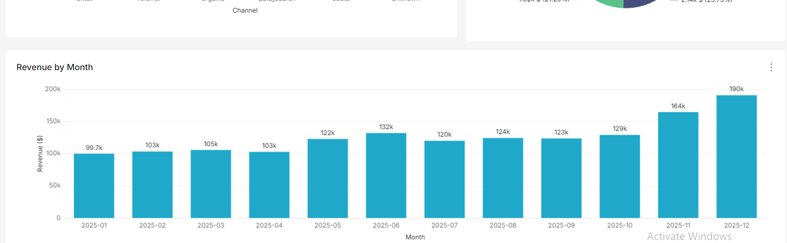

# ActiveShop E-Commerce Analytics (Final Project)

## Table of Contents

- [Project Goal]
- [Dataset Overview]
- [Repository Structure]
- [Phase 1. Data Cleaning & Preprocessing]
- [Phase 2. PostgreSQL & SQL Analysis (DBeaver)]
- [Phase 3. Python + Pandas - Key Business Insights & Analytical Findings (Answers to questions)]
- [Phase 4. Statistical Analysis & A/B Testing]
- [Phase 5. Data Visualization]
- [Phase 6. Interactive Streamlit Web Application]
- [Phase 7. ActiveShop Dashboard (Apache Superset)]
- [How to Run Locally]

## Project Goal
A comprehensive analytics project for the ActiveShop e-commerce store covering data cleaning, PostgreSQL integration, SQL queries, statistical analysis, A/B testing, visual dashboards in Apache Superset, and an interactive Streamlit web application.

## Dataset Overview
The project is built on 5 primary CSV files:
- `customers.csv`: Customer metadata (signup dates, demographics, A/B groups).
- `products.csv`: Product catalog (categories, brands, unit costs, list prices).
- `sessions.csv`: Web session logs and A/B test activity.
- `orders.csv`: Order metadata (statuses, payment methods, promo codes, totals).
- `order_items.csv`: Order line items (products, quantities, prices).

## Repository Structure

Final_Project_ActiveShop/
├── app/
│   ├── streamlit_app.py                  # Main streamlit application file & Overview page
│   └── pages/                            # Multi-page dashboard modules
│       ├── 1_Overview.py                 # Business KPIs & high-level summary
│       ├── 2_Sales.py                    # Revenue trends, categories & geography
│       ├── 3_Customers_&_Marketing.py    # Cohorts, channels & LTV analysis
│       └── 4_AB_Test.py                  # A/B test analysis & hypothesis testing
├── data/                                 # Initial and Cleaned CSV datasets
├── images/                               # Superset - ActiveShop Dashboard - screenshots
├── notebooks/                            # Jupyter notebooks for EDA and analysis
├── sql/                                  # SQL queries and schema scripts
├── DATA_DICTIONARY.md                    # Detailed dataset dictionary
├── FINAL_PROJECT.md                      # Project specifications & requirements
├── README_ENG.md                         # English documentation
├── README_RU.md                          # Russian documentation
└── requirements.txt                      # Project dependencies

**Live Streamlit App:** [ActiveShop Analytics Dashboard](https://finalprojectactiveshop-2a59tvzhvriti8nn8fcggl.streamlit.app/)

---------------------------------------------------------------------------------------------------------------------------------
---------------------------------------------------------------------------------------------------------------------------------

-----------------------------------------------------------------------------------------------
## Phase 1. Data Cleaning & Preprocessing
-----------------------------------------------------------------------------------------------

During the initial data audit, several anomalies and technical issues were identified and resolved:
- **Duplicate Removal:** Exact duplicate rows were removed across all datasets.
- **Age Anomalies:** Invalid customer ages (outside the range of 14–100 years) and missing values in `customers` were replaced with the median age.
- **Zero Quantities:** 1 row with `quantity = 0` was removed from `order_items`.
- **Missing Categorical Features:** Missing values in `payment_method`, `channel`, and `device` were filled with `'Unknown'`.
- **Valid Business Nulls:** Missing `order_id` values for non-converted sessions (`converted = 0`) and missing `delivery_days`/`customer_rating` for non-delivered orders were retained per business specification.

### Data Cleaning Summary Table

| Dataset | Rows Before | Rows After | Removed Rows |
| :--- | :---: | :---: | :---: |
| `customers` | 2,005 | 2,000 | 5 |
| `products` | 48 | 48 | 0 |
| `sessions` | 12,012 | 12,000 | 12 |
| `orders` | 3,926 | 3,918 | 8 |
| `order_items` | 7,420 | 7,409 | 11 |

---------------------------------------------------------------------------------------------------------------------------------
---------------------------------------------------------------------------------------------------------------------------------

-----------------------------------------------------------------------------------------------
## Phase 2. PostgreSQL & SQL Analysis (DBeaver)
-----------------------------------------------------------------------------------------------
To perform the analytical phase, the cleaned datasets were loaded into a PostgreSQL database (`activeshop_db`). All analytical scripts were developed and executed using the **DBeaver** SQL client. The final database schema and analytical query files are located in the `/sql` directory (`schema.sql` and `analysis.sql`).

During this phase, all required SQL tasks were completed, leading to the following key business insights:

### 1. Core KPIs
* **Successful Orders (`delivered`):** 3,588
* **Total Revenue:** $1,393,474.62
* **Average Order Value (AOV):** $388.37
* **Median Order Value:** $315.13
* **Unique Buyers:** 1,662

*Business Insight:* The median order value is significantly lower than the average (a $73.24 difference). This indicates a right-skewed distribution driven by high-value orders pulling the average up.

---

### 2. Monthly Sales Dynamics
The `LAG()` window function was utilized to calculate month-over-month revenue growth.
* **Peak Months:** December ($175,762.21, 447 orders) and November ($148,879.46, 377 orders).
* **Highest Growth:** In November, revenue increased by **+24.95%** compared to October.
* **Stable Plateau Period:** From May to October, monthly revenue remained consistent within the ~$110K–$119K range.
* **Lowest Months:** January ($92,807.24) and April ($93,580.34).

*Business Insight:* Sales exhibit strong Q4 holiday seasonality.

---

### 3. Category & Product Performance
Gross profit was calculated considering order-level discounts: `net_revenue - unit_cost * quantity`.
* **Top Categories by Revenue & Gross Profit:**
  1. *Apparel:* Revenue $361,281.75 | Gross Profit $136,663.42
  2. *Fitness:* Revenue $324,902.86 | Gross Profit $117,227.25
  3. *Outdoor:* Revenue $319,342.25 | Gross Profit $119,883.89
* **Top-3 Products by Revenue:** `Pulse Leggings Basic` ($68,115.58), `Pulse Jacket Basic` ($56,867.17), `NorthPeak Kettlebell Pro` ($56,059.16).
* **Top Products by Units Sold:** All top 5 positions belong to the **Footwear** category (led by `RunPro Trail Shoes Basic`, 298 units).

*Business Insight:* The Footwear category drives physical sales volume, while Apparel generates the highest net revenue and profit margin.

---

### 4. Product Ranking Within Categories
Using the `DENSE_RANK()` window function, a ranking of the top-3 highest-revenue products was compiled for each catalog category.

---

### 5. Customer Loyalty & Retention
* **Repeat Customers (>1 delivered order):** 1,059 customers
* **Repeat Customer Rate:** **63.72%** (1,059 out of 1,662)
* **Most Active Customers:** `C00685` and `C00779` (8 successful orders each).
* **Top Customer by Revenue:** `C01231` ($3,707.17, Yekaterinburg).

*Business Insight:* The store demonstrates strong customer retention (over 63% of buyers make repeat purchases).

---

### 6. Marketing Channel Performance
* **Organic Search (`organic`):** Generated the highest total revenue ($395,001.13) and total orders (1,092).
* **Highest Converting Channel:** `email` — **38.93%** conversion rate.
* **Lowest Converting Channel:** `social` — **27.92%** conversion rate.

---

### 7. Promo Code Impact Analysis
The investigation revealed that `'NONE'` values in the `promo_code` field denote the absence of a discount code.
* **Orders Without Promo Code:** 1,945 orders (54.2%)
* **Orders With Promo Code:** 1,643 orders (45.8%)

*Methodological Note:* Comparing orders with and without promo codes shows a difference in average order value; however, this does not imply direct causality (correlation does not equal causation). A higher AOV for promo code usage may simply reflect that customers with larger cart values are more motivated to apply discount coupons.

---

### 8. Analytical View (`v_order_analytics`)
A denormalized SQL view named `v_order_analytics` was created in DBeaver, combining delivered orders, customer attributes, and session data to streamline ingestion into Python and Apache Superset.

---------------------------------------------------------------------------------------------------------------------------------
---------------------------------------------------------------------------------------------------------------------------------

-----------------------------------------------------------------------------------------------
## Phase 3 Python + Pandas - Key Business Insights & Analytical Findings (Answers to questions)
-----------------------------------------------------------------------------------------------
### 1. Strongest and Weakest Months
**Analysis & Conclusion:**
* **Peak Revenue Months:** December ($175,762.21) and November ($148,879.46) represent the highest revenue periods, driven by Q4 holiday shopping and promotional campaigns.
* **Lowest Revenue Months:** January ($92,807.24) and April ($93,580.34) recorded the lowest sales volume, indicating a post-holiday demand slowdown.
* **AOV Trends:** Average Order Value remains stable across months ($374.68 – $406.38), indicating that revenue spikes are primarily driven by order volume rather than higher individual ticket sizes.

### 2. High-Revenue Categories with Low Profit Margin
**Analysis & Conclusion:**
* **Top Revenue Drivers:** **Apparel** ($361,281.75) and **Fitness** ($324,902.86) generate the highest net revenue and gross profit.
* **Margin Performance:** Gross margin across all categories ranges between **34.5% and 38.4%**.
* **Lowest Margin Category:** **Accessories** displays the lowest gross margin (**34.54%**) and relatively lower net revenue ($211,314.42), primarily due to product pricing and procurement cost structure.
* **High-Volume Leader:** **Footwear** achieves the highest percentage margin (**38.36%**) despite lower overall revenue, driven by high unit sales volume (2,145 units).

### 3. Top Performing and Underperforming Products
**Analysis & Conclusion:**
* **Top Revenue Drivers:** **Pulse Leggings Basic** ($68,115.58) and **Pulse Jacket Basic** ($56,867.17) are the highest revenue generators, both maintaining strong profit margins above 48%.
* **Lowest Revenue Products:** **NorthPeak Jacket Pro** ($3,924.17) and **NorthPeak Socks Basic** ($5,449.72) generate the lowest gross revenue.
* **Margin Insights:** 
  * Products like **NorthPeak Jacket Pro** (27.50% margin) and **TrailFox T-Shirt Pro** (26.91% margin) suffer from low total sales combined with compressed margins.
  * Conversely, items like **NorthPeak Socks Basic** exhibit high profit margins (51.77%) despite low revenue volume, making them prime candidates for cross-selling bundles.

### 4. Regional Revenue Distribution
**Analysis & Conclusion:**
* **Top Revenue Region:** The **Юг (South)** region is the absolute leader, generating **$349,024.75** (890 orders), nearly double the revenue of any other region.
* **Secondary Regions:** **Центр (Central)** ($188,457.94), **Урал (Ural)** ($178,903.24), and **Сибирь (Siberia)** ($178,046.94) form a solid second tier of revenue contributors.
* **AOV Consistency:** Average Order Value remains remarkably stable across all regions ($370.79 – $402.69), demonstrating that regional revenue disparities are driven by customer volume rather than price sensitivity differences.

### 5. Traffic Channel Conversion Analysis
**Analysis & Conclusion:**
* **Top Converting Channel:** **Email** marketing is the most effective channel, achieving the highest conversion rate at **38.93%** (721 conversions out of 1,852 sessions).
* **High-Intent Channels:** **Referral** traffic ranks second with a **36.29%** conversion rate, demonstrating strong customer trust and motivation.
* **Volume vs. Efficiency:** While **Organic** search generates the highest total session volume (3,414 sessions) and most absolute conversions (1,092), its conversion rate (**31.99%**) is lower than direct engagement channels like Email.
* **Lowest Performing Channel:** **Social** media traffic exhibits the lowest conversion rate (**27.92%**), suggesting that social visitors are primarily in the awareness phase rather than having immediate purchase intent.

### 6. New vs. Loyal Customer Behavior
**Analysis & Conclusion:**
* **Revenue Backbone:** Repeat / Loyal customers (1,059 customers) generate **82.3%** of total net revenue ($1,147,216.88 across 2,985 orders), making them the primary revenue driver.
* **Customer Lifetime Value (LTV):** Loyal customers spend nearly **2.7x more** on average ($1,083.30 vs. $408.39) throughout their lifecycle compared to first-time buyers.
* **Average Order Value (AOV):** New customers exhibit a slightly higher initial AOV (**$408.39**) than repeat customers (**$388.83**), suggesting high single-order intent, whereas loyal customers generate far higher overall revenue through repeat purchase frequency.

### 7. Delivery Speed vs. Customer Rating Analysis
**Analysis & Conclusion:**
* **Negative Correlation:** There is a statistically significant negative correlation (**-0.1423**) between delivery duration and customer ratings, confirming that longer delivery times directly impair customer satisfaction.
* **Fast Delivery Sweet Spot (1–4 Days):** Orders delivered within **1 to 4 days** receive the highest ratings, averaging consistently between **4.40 and 4.44**.
* **Rating Drop-off (5+ Days):** Average ratings start declining noticeably after day 5, dropping from **4.32** at day 5 down to **4.01** at day 8 and reaching a low of **3.60** at day 9.
* **Key Takeaway:** Fast logistics directly preserve brand reputation; keeping fulfillment under 4 days is critical for maintaining high customer satisfaction scores.

### 8. Promo Code Performance & Order Comparison
**Analysis & Conclusion:**
* **Most Popular Promo Code:** **SPORT15** is the most frequently used promo code, applied in **500 delivered orders** (generating $171,535.80 in revenue with a 15% discount).
* **Welcome & Seasonal Demand:** **WELCOME10** (446 orders) and **WEEKEND10** (442 orders) show nearly equal popularity, driving substantial acquisition and campaign sales.
* **Highest Discount Impact:** **LOYAL20** offers the highest discount (20%) across 255 orders, resulting in the lowest Average Order Value (**$309.57**).
* **Baseline Comparison (NONE):** Orders placed without a promo code (**NONE**) represent the majority (**1,945 orders**) and maintain the highest AOV (**$425.18**). While promo codes drive order volume and customer incentive, they expectedly lower the net average transaction value.

### 9. Customer Revenue Concentration Analysis
**Analysis & Conclusion:**
* **Top 20% Revenue Dominance:** The top 20% of customers (333 buyers spending over $1,310.46 each) generate **43.29%** of total net revenue ($603,295.96) with an average of 3.48 orders per customer.
* **Top 40% Cumulative Share:** Combining the Top 20% and the 60%–80% tiers reveals that the top 40% of the customer base accounts for **68.62%** of all total revenue.
* **Bottom 20% Contribution:** The lowest spending quintile (333 customers spending under $307.92) contributes only **4.18%** of net sales ($58,254.63).
* **Strategic Takeaway:** The business relies heavily on high-value repeat buyers. Implementing a dedicated loyalty/VIP retention program for the Top 20% segment is critical to protecting core revenue streams.

### 10. Additional Custom Business Insights

#### Insight 1: Revenue Leakage via Cancellations and Returns ($121,310.29 - Unrealized Gross Revenue / Unrealized Potential)
* **Quantified Impact:** Non-delivered orders account for **8.42% of total order volume** (330 orders out of 3,918) and **8.01% of total gross order value** ($121,310.29 out of $1,514,784.91).
  * **Cancelled orders:** 206 orders (5.26%) amounting to $74,340.58 (4.91%).
  * **Returned orders:** 124 orders (3.16%) amounting to $46,969.71 (3.10%).
* **Business Recommendation:** Investigate cancellation reasons during checkout and optimize post-purchase delivery speed/product expectation accuracy to recover a portion of the $121.3k unfulfilled volume.

#### Insight 2: Mobile Traffic Monetization Gap
* **Quantified Impact:** **Mobile** devices drive **62.91%** of total website sessions (7,549 sessions) but convert at **31.53%**, compared to **Desktop** visitors who convert at **35.26%**.
* **Business Recommendation:** Optimize mobile checkout flow and introduce one-click mobile payment solutions (e.g., Apple Pay / Google Pay) to bridge the 3.73% conversion rate gap with Desktop.

---------------------------------------------------------------------------------------------------------------------------------
---------------------------------------------------------------------------------------------------------------------------------

-----------------------------------------------------------------------------------------------
## Phase 4 - Statistical Analysis & A/B Testing
-----------------------------------------------------------------------------------------------

### 1. Hypothesis Formulation
* **Null Hypothesis (H_0):** The new checkout layout (Group B) does not affect first-session conversion rate (CR_A = CR_B).
* **Alternative Hypothesis (H_1):** The new checkout layout (Group B) significantly changes the first-session conversion rate (CR_A - CR_B).
* **Significance Level (α):** 0.05 (95% confidence level).

### 2. Test Execution & Statistical Results
* **Method:** Two-Sample Z-Test for Independent Proportions on unique customers' first sessions (N = 1,997).
* **Sample Size & Conversions:**
  * **Group A (Control):** 290 converted out of 999 users  **CR = 29.03%**
  * **Group B (Treatment):** 375 converted out of 998 users  **CR = 37.58%**
* **Test Metrics:**
  * **Absolute Difference (CR_B - CR_A):** +8.55 percentage points (+0.0855).
  * **Relative Lift:** +29.44 %.
  * **Z-Statistic:** 4.0518, **p-value:** 0.000051 (p < 0.001).
  * **95% Confidence Interval for Difference:** [+4.41 %, +12.68 %].

### 3. Business Decision
* **Statistical Decision:** Reject H_0 (p = 0.000051 < 0.05). The conversion rate difference is statistically significant.
* **Practical Impact:** Layout B delivers a strong boost to first-session conversion (+8.55 p.p., +29.44% relative lift). Even under conservative estimates (lower bound of 95% CI), conversion improves by at least +4.41 p.p.
* **Recommendation:** Full 100% rollout of the new checkout layout (Group B).

---------------------------------------------------------------------------------------------------------------------------------
---------------------------------------------------------------------------------------------------------------------------------

-----------------------------------------------------------------------------------------------
## Phase 5 - Data Visualization
-----------------------------------------------------------------------------------------------

#### Six core analytical charts were engineered to visualize key operational and financial dimensions of ActiveShop:

1. **Monthly Revenue Trend (2025):** Illustrates strong positive growth momentum throughout the year, escalating from $92.8k in January to a peak of $175.8k in December due to Q4 holiday seasonality.
2. **Gross Revenue by Product Category:** Highlights **Apparel** ($384.4k), **Fitness** ($344.5k), and **Outdoor** ($337.8k) as main revenue contributors. **Footwear** ($186.4k) generates lower monetary revenue.
3. **Top 5 Products by Revenue:** Identifies top-performing SKUs, led by *Pulse Leggings Basic* ($73.9k), *Pulse Jacket Basic* ($60.2k), and *NorthPeak Kettlebell Pro* ($60.0k).
4. **Revenue Distribution by Region:** Confirms the **Юг (South)** region as the top market segment ($349.0k), with all remaining regions performing steadily between $164.8k and $188.5k.
5. **Conversion Rate by Marketing Channel:** Displays high channel efficiency for **Email** (**38.93%**) and **Referral** (**36.29%**), contrasting with **Social** media (**27.92%**).
6. **A/B Test First-Session Conversion Comparison:** Visualizes the statistically significant uplift in first-session conversion from **29.03%** (Control A) to **37.58%** (Treatment B), representing an absolute gain of **+8.55 percentage points**.

#### Additional Exploratory Charts (1x2 Grid Summary)
* **Order Amount Distribution:** Order amounts follow a right-skewed distribution with a median of **$315.13** and a mean of **$388.37**, where higher-value orders stretch the distribution tail beyond $1,500.
* **Payment Method Breakdown:** **Card** payments clearly dominate total revenue at **56.6%**, followed by **PayPal** (**18.5%**), **Apple Pay** (**13.9%**), and **Cash** (**10.6%**).

### Business Insights & Actionable Recommendations (Phase 5 Summary)

1. **Full Rollout of Checkout Layout B:**
   * **Insight:** The A/B test confirmed a statistically significant conversion gain (+8.55 p.p.) on first sessions.
   * **Action:** Immediately transition 100% of desktop and mobile traffic to Layout B to maximize customer acquisition efficiency.

2. **Capitalize on South Region Momentum & Top Categories:**
   * **Insight:** **Apparel**, **Fitness**, and **Outdoor** drive the majority of gross revenue, with the **South (Юг)** region outperforming all other territories ($349.0k).
   * **Action:** Reallocate marketing budgets to scale successful campaigns in the South region and prioritize inventory replenishment for top SKUs (*Pulse Leggings Basic*, *Pulse Jacket Basic*).

3. **Re-evaluate Marketing Channel Allocation:**
   * **Insight:** Retention/direct channels (**Email** at 38.93% and **Referral** at 36.29%) demonstrate significantly higher conversion efficiency than paid acquisition via **Social** (27.92%).
   * **Action:** Audit ad targeting and creative performance on Social media to reduce customer acquisition costs (CAC), while expanding lifecycle email sequences and referral incentives.

4. **Streamline Payment Experience:**
   * **Insight:** Over **89%** of revenue is generated via digital payments (**Card** 56.6%, **PayPal** 18.5%, **Apple Pay** 13.9%).
   * **Action:** Optimize one-click payment integrations to further reduce checkout friction.

---------------------------------------------------------------------------------------------------------------------------------
---------------------------------------------------------------------------------------------------------------------------------

-----------------------------------------------------------------------------------------------
## Phase 6 - Interactive Streamlit Web Application
-----------------------------------------------------------------------------------------------

**Live Streamlit App:** [ActiveShop Analytics Dashboard](https://finalprojectactiveshop-2a59tvzhvriti8nn8fcggl.streamlit.app/)

To provide executive stakeholders with dynamic data access and interactive reporting, a multi-page web application was developed using **Streamlit** and deployed to **Streamlit Community Cloud**.

### Key Features & Structure
* **Architecture:** Multi-page app structure with centralized data loading and `@st.cache_data` optimization to maintain high performance across sessions.
* **Page 1: Overview** — Executive KPI summary (Total Revenue, Gross Revenue, Orders Count, Average Order Value, Unique Customers) with dynamic monthly range filters.
* **Page 2: Sales** — In-depth breakdown of revenue dynamics, product category performance, top-performing items, and regional sales distribution.
* **Page 3: Customers & Marketing** — LTV leaderboards, marketing acquisition channel conversion rates, customer retention segmentation (New, Loyal, VIP), and promo code usage analysis.
* **Page 4: A/B Test** — Statistical test results for the checkout layout experiment, sample size validation, p-value verification ($p = 0.000062$), and actionable business recommendations.

---------------------------------------------------------------------------------------------------------------------------------
---------------------------------------------------------------------------------------------------------------------------------

-----------------------------------------------------------------------------------------------
## Phase 7 - ActiveShop Dashboard (Apache Superset)
-----------------------------------------------------------------------------------------------

Below is the **ActiveShop Dashboard** built using Apache Superset. To ensure maximum readability and data clarity, both a full-page overview and high-resolution section screenshots are provided.

#### Full Dashboard Overview

**Click to view high-resolution dashboard sections**
**

### 1. Revenue KPI & Revenue by Region

### 2. Conversion Rate by Channel & Revenue by Category

### 3. Revenue Trend by Month

---------------------------------------------------------------------------------------------------------------------------------
---------------------------------------------------------------------------------------------------------------------------------

-----------------------------------------------------------------------------------------------
## How to Run Locally
-----------------------------------------------------------------------------------------------

### 1. Clone the repository:
git clone [https://github.com/svitlana-web/Final_Project_ActiveShop.git](https://github.com/svitlana-web/Final_Project_ActiveShop.git)
cd Final_Project_ActiveShop

### 2. Create and activate a virtual environment (optional but recommended):
python -m venv venv
# On Windows:
venv\Scripts\activate
# On macOS/Linux:
source venv/bin/activate

### 3. Install dependencies:
pip install -r requirements.txt

### 4. Launch the Streamlit app:
streamlit run app/streamlit_app.py

The dashboard will automatically open in your default browser at http://localhost:8501

**Live Streamlit App:** [ActiveShop Analytics Dashboard](https://finalprojectactiveshop-2a59tvzhvriti8nn8fcggl.streamlit.app/)

---------------------------------------------------------------------------------------------------------------------------------
---------------------------------------------------------------------------------------------------------------------------------
